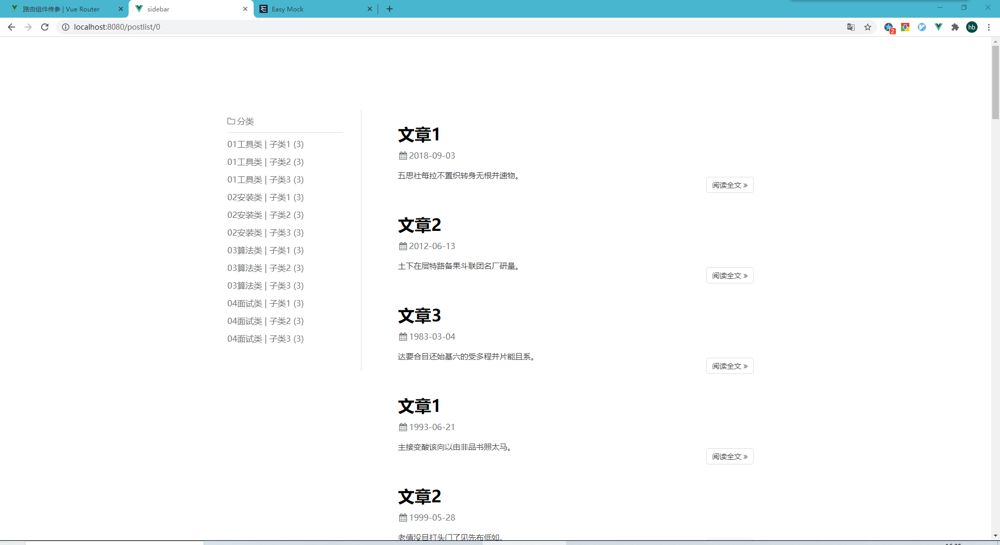
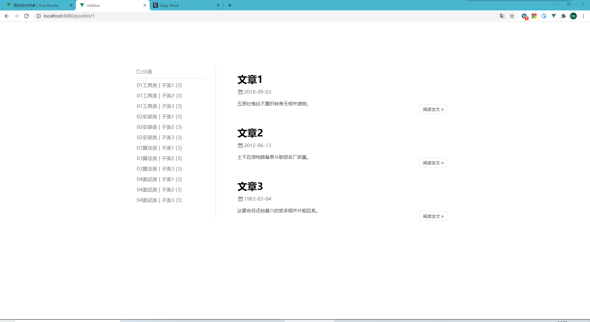
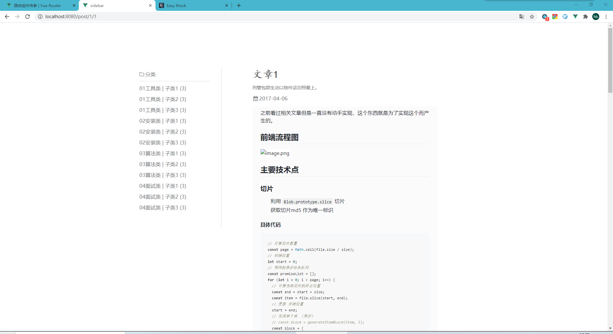

# post_category
  个人博客文章分类导航，列表展示，详细展示模块的项目

### 项目gitHub地址 [连接](https://github.com/WHBhorse/post_category)

### 所使用的技术栈
  + vue
  + vue-router
  + mock
  + axios

### 运行使用的依赖(vue-cli3基本配置以外的依赖)
  + font-awesome
  + mavon-editor

### 展示效果
  
  
  

## Project setup
```
npm install
```

### Compiles and hot-reloads for development
```
npm run serve
```

### Compiles and minifies for production
```
npm run build
```

### Run your tests
```
npm run test
```

### Lints and fixes files
```
npm run lint
```
